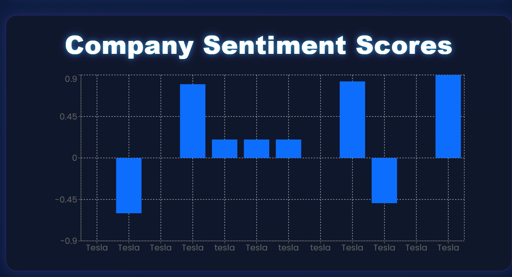
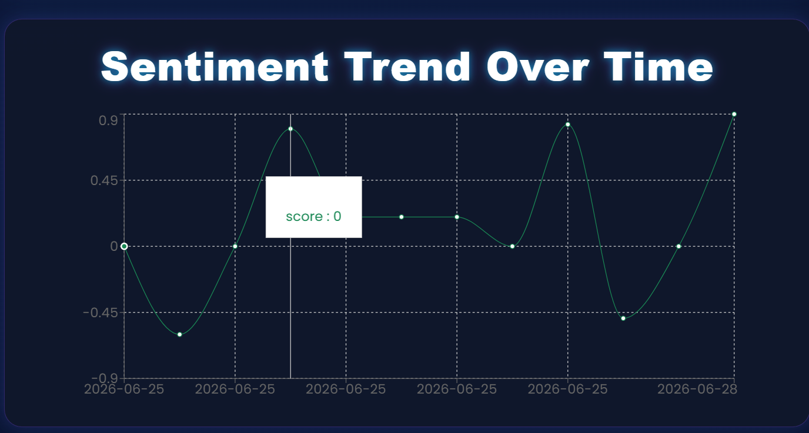
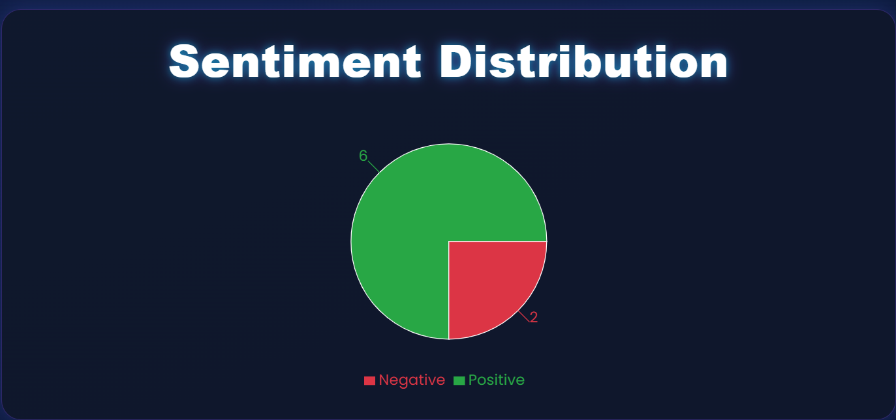
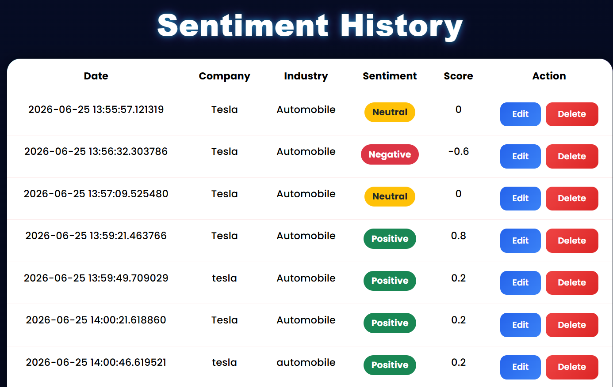
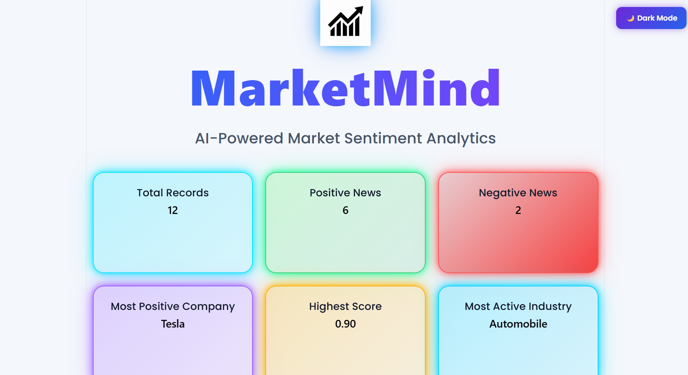

# 📈 MarketMind – AI-Powered Market Sentiment Analytics

MarketMind is a full-stack AI-powered web application that analyzes the sentiment of financial and market-related news articles. Users can submit market news, and the application predicts whether the sentiment is **Positive**, **Negative**, or **Neutral** using Natural Language Processing (NLP).

The application also stores results in a database and displays interactive dashboards with charts and analytics.

---

## 🚀 Features

- 🔍 Analyze market news sentiment
- 😊 Positive / 😐 Neutral / 😞 Negative prediction
- 📊 Interactive Dashboard
- 📈 Pie Chart Visualization
- 📉 Bar Chart Visualization
- 📅 Sentiment Trend Analysis
- 🏭 Industry-wise News Analysis
- 📋 Sentiment History
- 🔎 Search & Filter Records
- ✏️ Edit/Delete Records
- 📥 Export Results to CSV
- 🌙 Dark Mode / Light Mode

---

## 🛠 Tech Stack

### Frontend
- React.js
- Vite
- Bootstrap 5
- Recharts
- Axios
- CSS3

### Backend
- FastAPI
- Python
- SQLAlchemy
- SQLite
- TextBlob
- Uvicorn

---

## 📂 Project Structure

```
MarketMind
│
├── backend
│   ├── app.py
│   ├── sentiment.py
│   ├── database.py
│   ├── models.py
│   ├── requirements.txt
│   └── marketmind.db
│
├── frontend
│   ├── src
│   ├── public
│   ├── package.json
│   └── vite.config.js
│
|── README.md
|
└── screenshots

```

---

## ⚙ Installation

### Clone Repository

```bash
git clone https://github.com/Bhavana29-coder/MarketMind.git
```

```
cd MarketMind
```

---

## Backend Setup

```
cd backend
```

Create virtual environment

```
python -m venv venv
```

Activate

### Windows

```
venv\Scripts\activate
```

Install dependencies

```
pip install -r requirements.txt
```

Run Backend

```
uvicorn app:app --reload
```

Backend runs at

```
http://127.0.0.1:8000
```

---

## Frontend Setup

Open another terminal

```
cd frontend
```

Install packages

```
npm install
```

Run

```
npm run dev
```

Frontend runs at

```
http://localhost:5173
```

---

## 📊 Dashboard

The dashboard provides

- KPI Cards
- Sentiment Distribution
- Company Sentiment Scores
- Sentiment Trend
- Industry-wise Analysis
- Search & Filter
- Export CSV

---

## 🤖 Machine Learning

The project uses **TextBlob** for Natural Language Processing.

Output Classes:

- Positive
- Negative
- Neutral

Sentiment is calculated using **polarity scores**.

---

## 📷 Screenshots


### Dashboard


### Sentiment Prediction


### Analytics


### Distribution


### History


### Dark Mode



---

## 🔮 Future Improvements

- FinBERT Integration
- Real-time News API
- User Authentication
- Cloud Deployment
- Stock Price Prediction
- Multi-language Support

---

## 👩‍💻 Author

**Bhavana Saini**

GitHub:
https://github.com/Bhavana29-coder

---

## 📄 License

This project is developed for educational and academic purposes.
